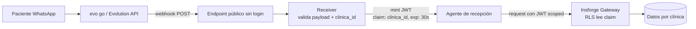
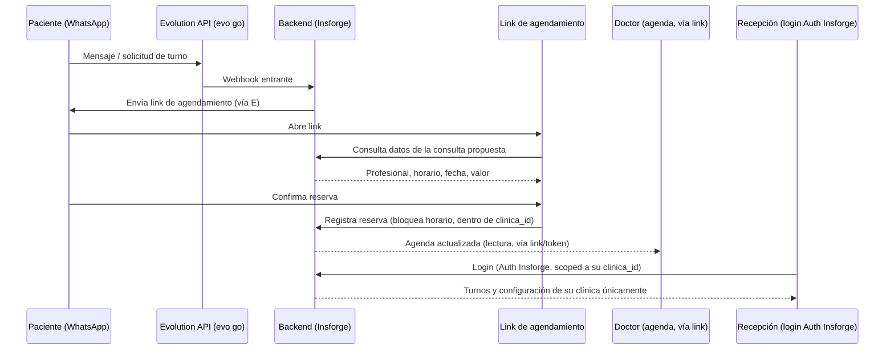

# SPEC — Agendamiento por WhatsApp para Clínicas/Consultorios

**Estado:** Draft v0.1 — deriva de 00-prd.md

## 1. Decisión de arquitectura

El sistema es **multi-tenant**: una misma plataforma sirve a varias clínicas, aisladas entre sí por `clinica_id` en cada tabla del modelo de datos. Expone: (a) un canal de WhatsApp vía Evolution API (evo go) para mensajería entrante/saliente, (b) un link de agendamiento (web view liviana) que muestra los datos de la consulta y captura la confirmación — sin login, acceso por posesión del `link_token`, (c) un panel de recepción con login real vía **Auth de Insforge**, scoped a la clínica del usuario logueado, y (d) un backend sobre Insforge para persistencia de turnos/disponibilidad/configuración de clínica. El doctor accede a su agenda vía link/token, igual que el paciente — sin cuenta propia en esta etapa. El agente de recepción conversacional (gateway de Insforge) queda condicionado al resultado del Spike 1 — si es NO-GO, el flujo de reserva vía link es determinístico y no depende del agente para el camino crítico.

**Resultado del Spike 1 (AGE-1): GO, con una pieza nueva.** Insforge soporta RLS nativas de Postgres, pero el binding es por **claim de JWT**, no por un campo `clinica_id` suelto en el body. Como el webhook de recepción es público (sin auth), hace falta una **capa mínima de token-minting**: el receiver valida `clinica_id` contra la tabla `Clinica` y mint-ea un JWT efímero (TTL 30s) con ese claim; toda operación posterior contra Insforge usa ese JWT — nunca la admin key (`ik_`), que bypasea RLS por completo. El aislamiento multi-tenant se fuerza así en el gateway (falla cerrado ante JWT ausente/expirado/con mismatch), no en la lógica del agente. Detalle completo, Gherkin y evidencia: ver el SPEC específico del spike (issue AGE-1 en Multica) y §5.1 más abajo.



**Alternativas consideradas:**
- WhatsApp Business API oficial en vez de Evolution API — descartada porque ya hay evo go en producción en otro proyecto, evita duplicar integración.
- Backend propio (NestJS + Supabase, stack habitual) en vez de Insforge — se prioriza Insforge por decisión explícita del proyecto, incluyendo su Auth nativo para evitar sumar un proveedor de auth aparte.
- Aislamiento multi-tenant por instancia/base separada por clínica — descartado para v1 por peso operativo; se usa `clinica_id` compartido en el mismo esquema, más simple de mantener con el equipo actual.
- Login/cuenta propia para el doctor — pospuesto; en v1 accede por link/token como el paciente, evita sumar un segundo flujo de auth en la primera etapa.



## 2. Stack técnico

| Capa | Elección | Alternativas consideradas |
|---|---|---|
| Canal WhatsApp | Evolution API (evo go) — ya en producción | WhatsApp Business API oficial |
| Backend / persistencia | Insforge | NestJS + Supabase (stack habitual) |
| Auth (solo recepción) | Auth nativo de Insforge, scoped por `clinica_id` | Proveedor de auth externo (Auth0, etc.) |
| Token-minting (agente de recepción) | Edge Function de Insforge (Deno), emite JWT efímero con claim `clinica_id`, TTL 30s | Worker propio (si Insforge exige provider OIDC externo) |
| Aislamiento multi-tenant | `clinica_id` compartido en el mismo esquema | Instancia/base separada por clínica |
| Link de agendamiento / agenda del doctor | Next.js + Tailwind + shadcn/ui + Radix + Framer Motion, acceso por token, sin login | — |
| Panel de recepción (login, config, turnos) | Next.js + Tailwind + shadcn/ui + Radix + Framer Motion | — |
| Agente de recepción (condicional a Spike 1) | Gateway de Insforge | Flujo determinístico propio |

## 3. Modelo de datos

Todas las entidades operativas llevan `clinica_id` para el aislamiento multi-tenant.

```
Clinica
  - id
  - nombre
  - logo_url
  - whatsapp_numero (instancia evo go)

Usuario (recepción — vía Auth de Insforge)
  - id (viene de Auth de Insforge)
  - clinica_id (FK)
  - nombre

Paciente
  - id
  - clinica_id (FK)
  - nombre
  - telefono_whatsapp

Profesional
  - id
  - clinica_id (FK)
  - nombre
  - especialidad
  - valor_consulta

Disponibilidad
  - id
  - clinica_id (FK)
  - profesional_id (FK)
  - fecha
  - horario
  - estado (libre | reservado)

Turno
  - id
  - clinica_id (FK)
  - paciente_id (FK)
  - profesional_id (FK)
  - disponibilidad_id (FK)
  - valor
  - estado (pendiente | confirmado | cancelado)
  - link_token (para acceso al link de agendamiento y a la agenda del doctor)
```

## 4. Contratos de API

| Método | Ruta | Descripción |
|---|---|---|
| POST | `/auth/login` | Login de recepción vía Auth de Insforge |
| GET/PUT | `/clinica` | Ver/configurar datos de la clínica (nombre, logo, WhatsApp, profesionales, horarios, valores) — requiere login, scoped a `clinica_id` |
| POST | `/webhook/whatsapp` | Recibe eventos entrantes de Evolution API |
| GET | `/agendamiento/:link_token` | Datos de la consulta propuesta (profesional, horario, fecha, valor) — sin login |
| POST | `/agendamiento/:link_token/confirmar` | Confirma la reserva, bloquea el horario — sin login |
| GET | `/agenda/:link_token` | Agenda del doctor (solo lectura) — acceso por token, sin login |
| GET | `/turnos` | Listado de turnos para recepción, con estado — requiere login, scoped a `clinica_id` |

## 5. Escenarios de aceptación (Gherkin)

```gherkin
Feature: Agendamiento por link vía WhatsApp

  Scenario: Paciente ve los datos de la consulta antes de confirmar
    Given un paciente recibió un link de agendamiento por WhatsApp
    When abre el link
    Then ve el profesional, horario, fecha y valor de la consulta propuesta

  Scenario: Confirmación de turno bloquea el horario
    Given un paciente ve los datos de una consulta disponible
    When confirma la reserva
    Then el turno queda en estado "confirmado"
    And el horario deja de estar disponible para otros pacientes

  Scenario: Doctor ve su agenda actualizada
    Given un turno fue confirmado para un profesional
    When el doctor abre su vista de agenda
    Then ve el nuevo turno reflejado con paciente, horario y fecha

  Scenario: Recepción ve el estado de los turnos
    Given existen turnos en distintos estados (pendiente, confirmado, cancelado)
    When recepción abre el listado de turnos
    Then ve cada turno con su estado actual

  Scenario: Aislamiento multi-tenant entre clínicas
    Given recepción de la Clínica A está logueada
    When intenta acceder a turnos o configuración de la Clínica B
    Then el sistema no devuelve ningún dato de la Clínica B

  Scenario: Doctor accede a su agenda sin login
    Given un doctor recibió un link de agenda
    When abre el link
    Then ve su agenda actualizada sin necesitar credenciales
```

### 5.1 Escenarios adicionales del agente de recepción (spike AGE-1)

```gherkin
Feature: El gateway de Insforge aísla datos por clinica_id y falla cerrado

  Scenario: Sin JWT (o JWT sin claim clinica_id), el gateway no devuelve nada
    Given una operación llega al gateway sin JWT o con JWT que no contiene el claim clinica_id
    When el gateway evalúa la policy
    Then rechaza la operación por default-deny
    And no expone datos de ninguna clínica

  Scenario: JWT expirado — el gateway niega
    Given un JWT emitido hace más de 30s (exp vencido)
    When el agente hace una query contra Insforge con ese JWT
    Then el gateway rechaza la request antes de aplicar la policy

  Scenario: El receiver nunca usa admin key para datos de negocio
    Given el receiver validó clinica_id y mint-eó un JWT
    When el agente lee o escribe agendamientos, pacientes o cualquier tabla de negocio
    Then la request usa el JWT scoped, NO la admin key
```

## 6. No-funcionales

- **Seguridad de datos de salud:** el link de agendamiento no debe exponer datos médicos/de salud del paciente en la URL ni en logs; el `link_token` es opaco (no incremental, no adivinable).
- **Latencia del flujo WhatsApp:** condicionado al resultado del Spike 1 (referencia de aceptación: < 5-8 segundos por turno de mensaje si el agente conversacional participa).

## 7. CLAUDE.md — puntos a incluir

- Nunca loguear contenido de mensajes de WhatsApp con datos del paciente en texto plano.
- El flujo crítico de reserva (link → confirmación) no debe depender del agente conversacional si el Spike 1 resultó NO-GO — debe poder operar de forma determinística.
- `link_token` se genera server-side, nunca se expone el ID interno del turno directamente en la URL.
- Componentes de UI: shadcn/ui + Radix como base, Tailwind para estilos, Framer Motion solo para transiciones/microinteracciones — no para lógica de layout.
- **Nunca hablar con Insforge con la admin key (`ik_`) desde el receiver o el agente para operaciones de datos de negocio** — bypasea RLS y rompe el aislamiento multi-tenant en silencio. Toda operación de negocio va con el JWT scoped emitido por el receiver. Si el aislamiento de tenant puede fallar, tiene que fallar cerrado.
